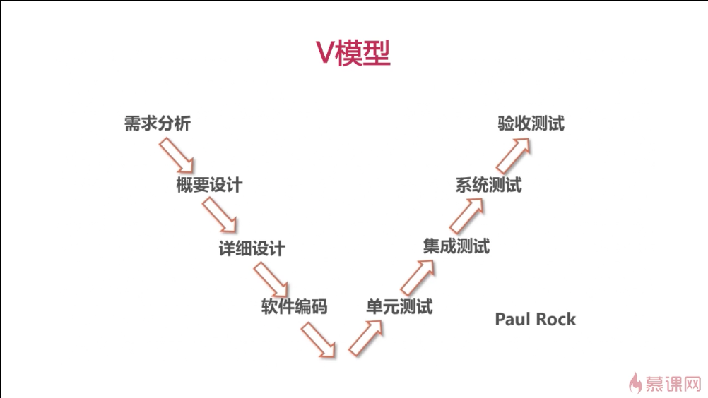

# 软件测试概要

## 什么是软件测试

> IEEE定义：使用人工或自动的**手段**来运行或测量软件系统的过程，以检验软件系统是否满足**规定要求**，并找出与**预期结果**之间的差异

- ### 软件测试的测试对象：

  - 软件概要设计
  - 软件详细设计
  - 软件运行环境
  - 可执行程序
  - 软件源代码
  - 软件需求

- ### 五大要素+两个目标

  - 质量；人员；
  - 测试覆盖率；测试效率
  - 资源；流程；技术

  > 提升测试覆盖率；提升测试效率

- ### 软件测试遵循的原则

  1. 测试显示缺陷存在，但不能证明系统不存在缺陷；

  2. 穷尽测试是不可能的，应设定即使终止的条件；

  3. **测试应该尽早进行；**
  4. 缺陷具备群集特性；
  5. 杀虫剂悖论；（测试用例和方法需要不停修改）
  6. 二八原则（80%资源用在20%重点模块上）
  7. 测试活动依赖于测试背景（金融依赖高安全性）

## 按测试阶段分类

> 单元测试；集成测试；系统测试；验收测试

- ### 单元测试：

  > 对软件中的最小可测试单元进行检查和验证；

  - 单元测试原则：
    - 尽可能保证各个测试用例相互独立
    - 一般由代码开发人员来实施，以检验所开发的代码功能符合自己设计要求
  - 单元测试好处：
    - 能尽早发现缺陷（敏捷开发，先开发测试，再开发代码保证通过测试）
    - 有利于重构
    - 简化集成
    - 文档
    - 用于设计
  - 单元测试的限制：
    - 不可能覆盖所有执行路径，不能保证捕捉到所有路径的错误
    - 每行代码一般需要3-5行测试代码
  - 单元测试框架：
    - Xunit
    - JUnit
    - PHPUnit
    - numit
    - CppUnit

- ### 集成测试：

  > 在单元测试的基础上，测试在将所有的软件单元按照概要设计规格说明的要求组装成模块、子系统或系统的过程中各部分工作是否达到或实现相应技术指标及要求的活动；

  - 主要实施方案
    - BigBang（全部组装好再测试）
    - 自顶向下
    - 自底向上（从最底层模块向上组装，最常用）
    - 核心系统集成（先集成核心部件，再集成外围）
    - 高频集成（搞快点）
  - 集成测试&单元测试
    - 测试对象不同
    - 测试依据不同
    - 测试方法不同（关心单元接口，关心单元内部）

- ### 系统测试：

  > 将经过集成测试的软件作为计算机系统的一个部分，与系统中其他部分结合起来，在实际运行环境下对计算机系统进行一系列严格有效的测试，以发现软件潜在的问题，保证系统的正常运行。（一般用真实环境；单元和集成常用虚拟环境）

  - 关注点：
    - 关注系统本身的使用
    - 关注系统与其他相关系统间的连通
    - 关注系统在不同使用压力下的表现
    - 关注系统在真实使用环境下的表现
  - 系统测试&集成测试
    - 测试对象：
      - 集成测试：通过了单元测试的各个模块集成起来的构建
      - 系统测试：除了软件以外还包括计算机硬件及相关的外围设备、数据采集和传输机构、支持软件、系统操作人员等整个系统
    - 测试时间：
      - 集成测试：介于单元测试和系统测试之间测试
      - 系统测试：在集成测试之后
    - 测试内容：
      - 集成测试：各个单元模块之间的接口
      - 系统测试：整个系统的功能和性能
    - 测试角度：
      - 集成测试：偏于技术角度的验证
      - 系统测试：偏于业务角度的验证

- ### 验收测试：

  > 交付测试。针对用户需求、业务流程的正式的测试，确定系统是否满足验收标准，由用户、客户或其他授权机构决定是否接受系统。

  - 细分：
    - 用户验收测试
    - 运行验收测试
    - 合同和规范验收测试
    - Alpha测试（用户在开发提供的场所和环境中进行测试，内测？）
    - Beta测试（在用户提供的场景和环境测试，完全脱离开发环境，公测？）
    - 验收测试驱动开发（敏捷开发）

## 按测试手段分类

> 黑盒测试、白盒测试；
>
> 静态测试、动态测试；
>
> 手工测试、自动化测试；

- ### 黑盒测试：

  > 不考虑内部结构，只检查能不能work，不考虑内部逻辑
  >
  > 从用户视角，用户需求出发
  >
  > 在系统测试阶段比较多用

  - 优点：
    - 更容易实施，不需要关注内部实现
    - 更贴近用户使用角度
  - 缺点：
    - 不可见，测试覆盖率低，一般只有40%不到
    - 做自动化测试，复用率低，维护成本高
  - 主要测试什么：
    - 是否有不正确/遗漏功能？
    - 在接口上，输入能否正确接受，能否输出正确结果
    - 是否有结构错误/外部信息（数据文件）访问错误
    - 性能上能否满足要求
  - 主要设计方法：
    - 等价类划分法：等价的归成一类
    - 边界值分析法：关注边界条件
    - 错误推测法：根据经验判断可能出错点
    - 因果图法：—>判定表
    - 正交试验分析法：筛选输入输出再测试
    - 状态迁移图法
    - 流程分析法

- ### 白盒测试：

  > 内部可见透明，结构化测试，透明测试
  >
  > 用逻辑覆盖率判定测试完整性

  - 主要逻辑单位：
    - 语句
    - 条件
    - 条件组合
    - 分支
    - 路径
  - 优点：
    - 迫使测试人员仔细思考软件的实现，理解原理
    - 可以监测代码中每条分支和路径
    - 揭示隐藏在代码中的错误
    - 对代码的测试比较彻底
  - 缺点：
    - 贵
    - 无法检测遗漏的路径和数据敏感性错误
    - 不能直接验证需求的正确性
  - 主要测试方法
    - 代码检测法：代码本身进行检查
    - 静态结构分析法：检查内部结构
    - 静态质量度量法：根据标准
    - 逻辑覆盖法：上面6种主要覆盖方法
    - 基本路径测试法：分析控制构造

- ### 灰盒测试

  > 介于黑，白盒测试之间的，关注输出对于输入的正确性，同时也关注内部实现

- ### 静态测试

  > 无需执行被测程序，通过评审软件文档或者代码，度量程序静态复杂度，检查软件是否符合编程标准；可以自动化检测；（白盒主要）

  - 互审<—> 走查 <—> 会议

- ### 动态测试

> 通过运行被测程序，检查运行结果与预期结果的差异，分析运行效率、正确性和robust性；（黑盒主要）

- ### 手工测试

  > 由专门测试人员从用户角度验证软件是否满足设计要求的行为。更适合针对深度的测试和强调主观判断的测试。（众包测试，探索性测试）

- ### 自动化测试

  > 使用单独的测试工具软件控制测试的自动化执行及对预期和结果进行自动检查
  >
  > （单元测试、接口测试、性能测试 … ）

  - 手工测试VS自动化测试
    - 手工测试：
      - 易发现缺陷
      - 容易实施
      - 创造性、灵活性
      - 覆盖量化难
      - 重复测试效率低
      - 不一致性、可靠性低
      - 人力资源依赖
    - 自动化测试：
      - 高效率、速度快
      - 高复用率
      - 覆盖率容易度量
      - 准确、可靠
      - 不知疲劳
      - 机械、发现缺陷率低
      - 一次性投入比较大

## 按测试模式分类

> 瀑布模型、敏捷模型、基于脚本的测试、基于风险的测试、探索式测试 …

- ### 瀑布模型

  - 项目计划 —> 需求分析 —> 软件设计 —> 程序开发 —> 软件测试 —> 集成维护
  - 优点：
    - 强调需求、设计的作用
    - 前一阶段完成后，只需要关注后续阶段
    - 为项目提供了按阶段划分的检查点，里程碑清晰
    - 文档规范
  - 缺点：
    - 难以适应需求频繁变更
    - 项目周期后段才能看到成果
    - 强制的里程碑、完成时间点
    - 文档工作量大

- ### V模型（目前使用最广泛）

  

  - 需求分析 —> 概要设计 —> 详细设计 —> 软件编码 —>|

    验收测试 <— 系统测试 <— 集成测试 <— 单元测试 <—

  - 没有尽早测试

- ### W模型

   

  - **用户需求 —> 需求分析 —> 概要设计 —> 详细设计 —> 编码 —>**

    验收测试设计 —> 系统测试设计 —> 集成测试设计 —> 单元测试设计 —> 单元测试

    **<— 交付 <— 实施 <— 集成 <—**

    <— 验收测试 <— 系统测试 <— 集成测试 <—

  - 尽早测试
  - 不太好支持迭代

- ### X模型

  

- ### H模型

  

- ### 敏捷测试

  - 敏捷宣言：

    - 个体和交互 重于 过程和工具
    - 可用的软件 重于 完备的文档
    - 客户协作 重于 合同谈判
    - 响应变化 重于 遵循计划
    - 后者并非全无价值，但是更看重前者

    > 强调从客户角度测试
    >
    > 重点关注迭代测试新功能，不在强调测试阶段
    >
    > 尽早测试，不间断测试，具备条件就测试
    >
    > 强调持续反馈
    >
    > 预防缺陷重于发现缺陷

  - 敏捷测试 VS 传统测试

    - 敏捷测试：
      - 开发和测试紧密合作，大家都有责任对软件负责
      - 变更时可接受的，拥抱变更
      - 计划随着进展时常调整
      - 只需要绝对必要的文档
      - 各迭代之间已经没有明显的入口出口标准
      - 所有阶段都需要自动测试，每个人都需要做，是项目集成的一部分
      - 流程不再需要严格执行
      - 团队合作是无缝隙合作
    - 传统测试：
      - 测试是质量的最后保护者
      - 严格的变更管理
      - 预先的计划和细节的准备
      - 重量级文档
      - 各阶段测试严格的入口出口标准
      - 更多在回归测试时进行重量级的自动化测试
      - 严格依赖流程执行
      - 测试团队和开发团队相对独立

- ### 基于脚本的测试 — SBT (Script-base Testing)

  - Scripted Testing (ST)

- ### 探索性测试Exploratory Testing (ET)

  > 完全抛开测试脚本的测试
  >
  > 更多是一种风格

  - ST
    - 系统性强
    - 容易管理、控制
    - 设计在先、执行在后
    - 主要是验证自己思路
    - 可预见性
  - ET
    - 自由灵活
    - 和ST互补
    - 执行和设计（思考）并行
    - 不断和系统交互，带着问题测试
    - 学习的过程
  - 探索式测试优点
    - 能激发测试人员的创造性
    - 增加发现新、深入bug可能性
    - 在较短时间内找到更多bug以及对SUT (system under test)做一个快速评估
    - 有利于更加有效的实施自动化
    - 更适用于敏捷项目
    - 减少了在简单、重复用例的编写时间
  - 缺点
    - 测试管理上有局限性，难协调和控制
    - 对bug的重复利用和重现作用有限
    - 对测试人员的测试技能和业务知识深度有较高要求
    - 只有在系统完全可用的前提下才有用
    - 生产率很难定义
    - 难自动化
  - 局部探索式测试：
    - 输入
    - 状态
    - 代码路径
    - 用户数据
    - 执行环境
  - 全局探索式测试 — 漫游测试法
    - 商业区：用户开启到关闭主要使用的功能区域
    - 旅馆区：软件在休息和后台的进程的
    - 历史区：版本遗留代码
    - 旅游区：新用户主要会关注的区域（新用户注册，新手指引）
    - 娱乐区：系统主要功能以外的辅助功能区
    - 破旧区：一般不在用户手册中提及的
  - 执行探索式测试：
    - Know You Mission：了解测试重点，环境，方向
    - Learning Session：详细学习，探索被测系统，环境
    - Coverage Session：主要功能点的验收，尽可能全覆盖
    - Deep Session：进一步深入测试
    - Close Session：总结测试信息，分析测试过程，覆盖率
    - 缺陷大扫除（也可能放在deep session中）

- ### 基于风险的测试 — RBT

  > Risk-base Testing，一种基于对软件失效的风险评估并以此指导测试计划、设计、执行、结果评价的软件测试类型。

  - 有哪些风险？
    - 质量风险
    - 管理风险
    - 风险级别 = 风险可能性 \* 风险严重度
  - 识别风险
    - 可能性
      - 复杂性
      - 时间压力
      - 高变更率
      - 技能水平
      - 地理分散度
    - 严重程度
      - 使用频率
      - 失效可视性
      - 商业损失
      - 组织负面影响和损害
      - 社会损失和法律责任
    - 风险要素分 = Sum(单项权重 \* 得分)
  - RBT优点
    - 风险随测试工作量快速降低
    - 质量信心有保证

- ### 基于模型的测试 — MBT

  > Model-base testing is software testing in which test cases are derived in whole or in part from a model that describes some (usually functional) aspects of the system under test (SUT).
  - 主要是对需求功能点建模
  - 偏向于自动化测试
  - 主要MBT工具
    - Spec Explorer (Microsoft)
    - GraphWalker (OpenSource)
    - Tcases (OpenSource)
    - modeljunit (OpenSource)

## 按测试类型分类

> 功能测试；
>
> 性能测试、部署测试、文档测试、安全测试；
>
> 兼容性测试、易用性测试、本地化测试、无障碍测试；
>
> 可靠性测试；

- ### 功能测试

  > 根据产品特性、操作描述和用户方案，测试产品特性和可操作行为已确定满足设计需求**「对提供给用户的软件功能进行验证。」**

  - 针对的问题：
    - 功能错误或遗漏、界面问题、性能错误、数据访问错误、初始化/终止错误；
  - 功能测试工具：
    - QTP winrunner
    - silkTest
    - Rational robot
    - **selenium（开源，web测试，敏捷开发，流行）** 
    - Watir（基于Ruby，web测试）
    - Sikuli（主要由截图）

- ### 性能测试

  > 负载测试（逐步增加负载，确定出最大负载）；压力测试（确定出最大极限）；稳定性测试（稍大于正常负载的长时间运行，确定稳定性）

  - 性能指标：
    - 并发用户数VU
    - 每秒事物数TPS
    - 系统响应时间
    - 设备性能
  - 性能测试工具：
    - LoadRunner
    - Silkperformer
    - Jmeter
    - WebLoad
    - Apache Bench
    - LoadUI
  - 静态性能评估
    - 开发web应用时，基于一系列web应用页面性能优化的最佳实践对web应用的页面进行静态分析，并给出评估结果的性能分析方法。
    - 常用工具：YSlow（chrome上搜不到官方插件），PageSpeed

- ### 应用性能管理（APM）

  >  application performance management，提供对系统的实时监管以实现性能管理、故障管理的解决方案。

- ### 安全测试
  
  - 通过模拟对软件系统的恶意攻击行为来评估系统安全性的测试。
  - 渗透测试 — 攻 — 点；安全测试 — 防 — 面；
  - OWASP：open web application security project
    - **wiki：OWASP top10**
    - **wiki：OWASP Test Guide**
  - 常用工具：
    - Appscan
    - Webinspect
    - Nessus
    - Nmap（端口扫描）
    - MetaSploit
    - WebScarab
    - Fortify
  - W3AF
  
- ### 兼容性测试

  > 软件本身的兼容性、不同平台下的兼容性、软件对运行设备的兼容性、软件互操作性

  - 浏览器内核兼容性：
    - IE-8,9,10（Trident4-6）
    - FireFox（Gecko）
    - Safari、Chrome（Webkit）
    - Opera（presto）
  - 浏览器兼容性测试工具：
    - BrowserShots
    - BrowserSandbox
    - Google浏览器兼容测试插件

- ### 文档测试

  > 针对软件产品的交付品，配套的额文档类部件的测试。如用户手册、使用说明、用户帮助文档

  - 关注要点：完整性、正确性、一致性、易理解性、易浏览性

- ### 可靠性测试

  - 软件可靠性，硬件可靠性（主要）

- ### 易用性测试

  > 测试用户使用软件时是否感觉方便，是否能保证用户使用体验的测试类型。

- ### 本地化测试

  > 针对软件本地化版本实施的针对性测试（汉化版、英文版）

  - 主要测试内容：语言、书写习惯（错位）；时区、日期格式、货币；当地法规、风俗；政治敏感性内容

- ### 部署测试

  > 也称安装测试，主要验证系统部署过程，确保软件经过安装测试后可以正常使用

  - 主要测试内容：不同环境下的部署验证；参照部署文档执行，过程合理、正确性；基础数据

- ### 无障碍测试

  > 便于特殊人群的测试

## 其他测试类型

> 回归测试；冒烟测试；Monkey测试；AB测试；

- ### 回归测试

  > 软件功能修改后，重新测试确认修改没有引入新的错误

  - 重心在**关键模块**和**重点功能组件**。
  - 研发周期中会进行多次回归测试，尽量实现自动化。

- ### Monkey测试

  > 搞怪测试，用些随机奇怪的方式操作，测试robust性

- ### 冒烟测试

  > 确认代码中的更改会按预期运行，且不会破坏整个版本的稳定性

- ### **A/B测试（常用）**

  > 多用于互联网行业，通过为页面提供两个版本给用户使用并记录相关用户行为数据，来确定更优化的一种测试方案

  - 实施要点：
    - 多个方案并行
    - 每次测试只改动一个变量
    - 按某种规则优胜劣汰
  - A/B测试工具：
    - Google Analytics Content Experiments
    - Visual Website Optimizer

## Reference:

[慕课网：软件测试基础-概念篇](https://www.imooc.com/learn/700)